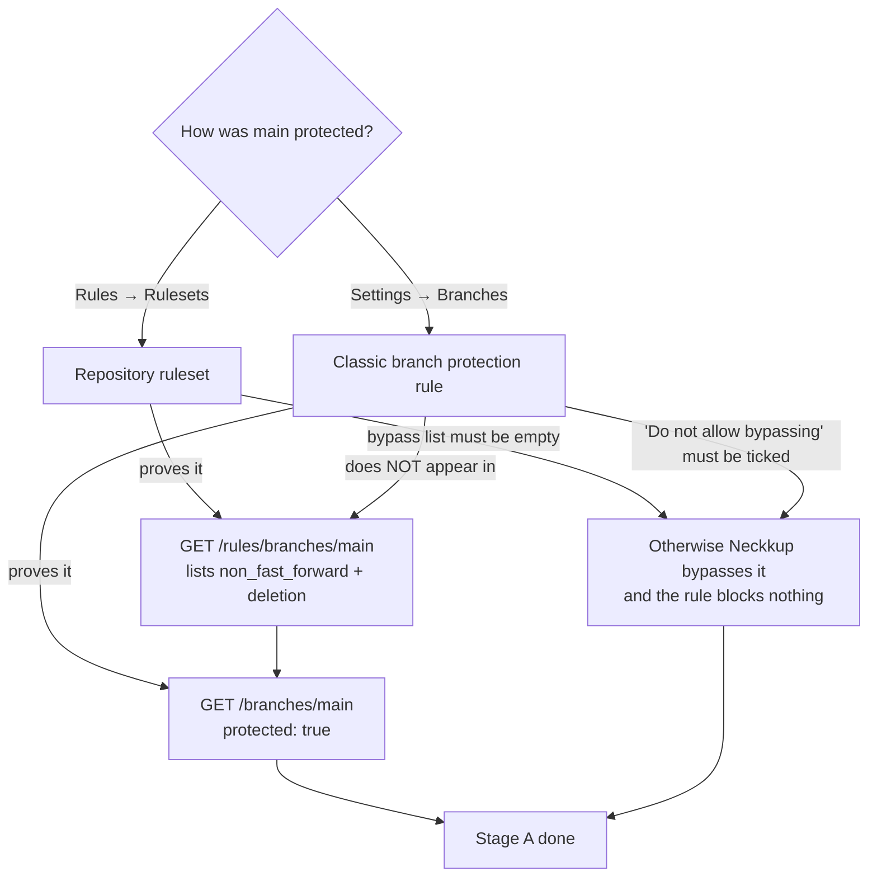

# ADR 0007 — Branch protection on `main`

- **Status:** **amended 2026-09-24 — the founder chose the public route and declined the spend.** The
  section "Founder decision, 2026-09-24" at the bottom is what we are doing. Everything above it is the
  CTO's recommendation as written on 2026-09-23 and is kept unedited, because the reasoning it was
  overruled on is the thing worth being able to read back.
- **Date:** 2026-09-23, amended 2026-09-24
- **Decided by:** CTO (recommendation); founder (decision, PRO-112)
- **Issue:** PRO-111 (proposed by PRO-105, triggered by the force push in PRO-110); spend declined in PRO-112

## Decision

`Neckkup/steamkid` **stays private** and we **buy GitHub Pro** ($4/month, one
seat, personal account) to get branch protection on it. We do not make the
repository public to obtain protection for free.

Enforcement lands in two stages, and the staging is the load-bearing half of this
decision:

| Stage | Rules on `main` | Changes how we work? | When |
| --- | --- | --- | --- |
| **A** | block non-fast-forward pushes; block branch deletion; **bypass list empty** | no | the day Pro is active |
| **B** | required status checks `verify` + `secret-scan`, strict | **yes — `main` becomes PR-only** | separate ticket, not now |

Stage A closes the exact hole PRO-111 was opened for. Stage B is the one PRO-105
asked for, and it is deferred for a reason given below rather than forgotten.

Until Stage A is live, `.github/workflows/main-guard.yml` fails the build on any
force push to `main` and prints the SHA that was overwritten. It prevents nothing.
It exists so the one event we cannot block is not also silent.

## What was measured, today

All three readings taken 2026-09-23 through the Paperclip GitHub App token, which
acts as `Neckkup` (repo admin):

| Endpoint | Required app permission | Result |
| --- | --- | --- |
| `GET /repos/Neckkup/steamkid/rulesets` | `metadata=read` | **403** — `Upgrade to GitHub Pro or make this repository public to enable this feature.` |
| `GET /repos/Neckkup/steamkid/rules/branches/main` | `metadata=read` | **403**, same message |
| `GET /repos/Neckkup/steamkid/branches/main/protection` | `administration=read` | **403** — `Resource not accessible by integration` |

Plus: `visibility: private`, owner type `User` (not an Organization), one
collaborator (`Neckkup`, admin), and `main` reads `protected: false`.

**Two different 403s, and the difference is the finding.** The rulesets routes
require only `metadata=read` — a permission we demonstrably hold, since the same
token lists branches and collaborators — and they still refuse, with GitHub's own
plan message. That is unambiguously the plan, not our token. The branch-protection
route requires `administration`, which the app installation does not have, so that
403 says nothing about the plan at all.

Owner type `User` is why the option is **Pro** and not **Team**: Team is an
organization product, and this repository is not in an organization.

## Why not make it public

Rejected, and not narrowly.

The repository is not "an app". It is the design of how a children's product
handles children's data: the event taxonomy, the redaction rules, the consent
model, the grading prompts, and `scripts/sql/roles.sql` — which is a written map
of our privilege boundaries and the exact grants that keep the runtime role from
touching training data. Publishing that is publishing the blueprint of the control
you would attack.

The asymmetry is what settles it. Public is **reversible as a setting and
irreversible as an event**: flipping back to private does not un-clone, un-fork or
un-index anything that was taken while it was open, and it does not un-leak a
secret that our `secret-scan` job missed — that job is a cheap backstop, not a
proof. So we would be trading a permanent exposure for a recurring $4. *Blast
radius of children's data: assume anything that leaves our infrastructure is
permanent.*

There is also a smaller, non-security reason: going public to obtain a CI gate
means a product-positioning decision gets made by a billing constraint. That is
CEO's call to make deliberately or not at all, not something to fall into sideways.

## Why Stage B is staged, and not just switched on

PRO-111's done criteria asks for required `verify` + `secret-scan`. Doing that
today would cost more than it buys, and the reason is worth writing down because
it is not obvious from the GitHub settings page.

**A required status check cannot pass on a commit that has not been pushed yet.**
So requiring checks on `main` does not mean "pushes are checked" — it means direct
pushes to `main` stop working, and every change must arrive through a pull request
that waits for CI and is then merged. Every agent on this team pushes straight to
`main` today. Stage B is therefore a change to how the whole fleet works, not a
checkbox: each agent must open a PR, wait for two jobs, and merge — and waiting is
the thing our heartbeat model handles worst, since a heartbeat that blocks on CI
is a heartbeat spent polling.

That change may well be right. It is a different ticket, with its own migration,
and coupling it to "stop `main` from being erased" would delay the cheap fix
behind the expensive one.

**The second thing that is not obvious: an empty bypass list is mandatory.** The
only actor who can damage `main` is the repo owner — every agent push is the
Paperclip GitHub App acting as `Neckkup`, who is admin. GitHub's default is that
admins bypass. A ruleset configured with the owner in the bypass list would be
protection against the empty set: it would read as green on the settings page and
stop precisely nobody. If Stage A is configured with any bypass actor, it has not
been done.

## What this costs, and who decides

$4/month, one seat, GitHub Pro on the `Neckkup` personal account. Spend is not
mine to commit — raised for [CEO](/PRO/agents/ceo) as a child issue of PRO-111.

*Buy before build:* the alternative to $4/month is not "free", it is us building
and maintaining detection-only substitutes for a control GitHub sells. We already
built one (`main-guard.yml`) and it still cannot stop anything.

**Two gates have to clear, not one.** Pro removes the plan gate. It does not
remove the second: the GitHub App installation holds no `administration`
permission, so no agent can create the ruleset through the API even on Pro. That
leaves two ways to configure it, and the first is preferred:

1. Grant the Paperclip GitHub App `administration: write` on this repository, and
   an agent configures the ruleset and re-reads it back as proof.
2. Failing that, the founder sets it in the repository settings UI — Rules →
   Rulesets → `main` → *Restrict force pushes* + *Restrict deletions*, bypass list
   empty.

Only the repository owner can widen a GitHub App's permissions, so that specific
step is genuinely not delegable to an agent. Everything after it is.

## Migration cost if we are wrong

| If wrong about | Cost to change |
| --- | --- |
| Staying private | **Low.** Going public later is one setting, and it is still available at any time. The reverse is what we cannot do, which is the entire argument. |
| Paying for Pro | **Very low.** Cancel the plan; protection lapses and we are back to today's state. No data, code or workflow moves. |
| Staging B behind A | **Low, and it decreases.** Adding required checks later is a ruleset edit. The real cost is the fleet's move to PR flow, and that cost is the same whenever it is paid. |
| Personal account rather than an org | **Moderate, and rising slowly.** Moving to an organization later is a repo transfer plus re-pointing the App installation, deploy hooks and secrets. Cheap at one collaborator; it is the second and third teammate who make it expensive. Worth revisiting when we hire, not now. |
| `main-guard.yml` as the interim control | **None.** It is 20 lines and gets deleted when Stage A lands. |

## What this deliberately does not decide

- **Moving the repository into a GitHub organization.** Related, separately
  argued, and only worth doing when there is more than one human.
- **Required reviewers on pull requests.** Meaningless with one human reviewer;
  revisit with Stage B.
- **Whether agents should use PR flow generally.** That is the Stage B ticket.

## Verification

1. The plan gate is real and is the plan, not our token — **done 2026-09-23**, the
   three-row table above, with the `X-Accepted-Github-Permissions` header read off
   each response so the two 403s could be told apart.
2. `main-guard.yml` fails on a force push and passes on a fast-forward — the
   fast-forward half is exercised by the commit that adds it. The failing half is
   asserted, not measured: proving it requires force pushing `main`, which is the
   thing this file exists to discourage. It will be measured the first time someone
   does it anyway, which is the only honest test schedule for it.
3. Stage A is live with an empty bypass list — pending Pro. Proof is
   `GET /repos/Neckkup/steamkid/rules/branches/main` returning the two rules and
   `main` reading `protected: true`, not a screenshot of the settings page.

---

## Founder decision, 2026-09-24

**Asked in PRO-112:** approve $4/month for GitHub Pro, or name the alternative.

**Answered:** do not pay. **Make `Neckkup/steamkid` public instead**, and take branch protection on the
free tier.

That overrules the recommendation above. The rest of this section is what the decision changes, what it
does not change, and what we measured before acting on it — not a re-argument of it.

### What we measured before publishing, 2026-09-24

The whole case against going public rests on exposure being permanent. So the question that actually
matters is not "should we publish" — that is settled — but **"what exactly is in the 69 commits we are
about to publish"**, which nobody had asked yet.

The CI `secret-scan` job does not answer it. It runs `git grep` over the **working tree at `HEAD`**, so a
credential that was committed and later removed is invisible to it and still fully present in history.
While the repository is private that gap costs nothing. On the day it goes public, that gap *is* the risk.

So the sweep was run over every commit reachable from every ref, with a pattern set considerably wider
than CI's:

| Checked across all 69 commits | Result |
| --- | --- |
| CI's own pattern set (`sk-ant-`, `pk-lf-`, `sk-lf-`, `ghp_`, Sentry DSN) | only `*-not-the-leaked-one` fixtures in `leaked-credentials.test.ts` |
| Google (`AIza…`), AWS (`AKIA…`), all GitHub token prefixes, Slack (`xox…`), JWTs, `BEGIN … PRIVATE KEY` | none |
| Postgres / MySQL / MongoDB / Redis URLs carrying a password | only test fixtures, every one with the literal password `pw` |
| `.env`, `.env.*`, `*.pem`, `*.key`, `*.p12`, `id_rsa*`, `*service-account*` ever added in any commit | only `.env.example`, and every value in it is blank |
| Supabase project refs, real Sentry DSNs, account-identifying hostnames | none — the only hostname is `aws-0-ap-southeast-1.pooler.supabase.com`, a shared regional endpoint that identifies no project |

**History is clean.** No credential has to be rotated before publishing, and no history rewrite is needed.
That is a real finding and it makes this decision materially cheaper than the section above assumed — the
worst case in "Why not make it public" was a secret `secret-scan` had missed, and there is not one.

What we publish is therefore design, not credentials: the event taxonomy, the redaction rules, the consent
model, the grading prompts, and `scripts/sql/roles.sql`. That disclosure is real and it is the thing the
founder decided to accept. Two consequences of it are worth naming precisely, because they are the parts
that bite later rather than on day one:

- **`scripts/sql/roles.sql` becomes a published description of our privilege boundaries.** It documents
  which grants keep the runtime role away from training data. It contains no passwords, so it is not a key
  — it is a map. The mitigation is that the boundary must hold against someone who has read it, which is
  what `npm run verify:roles` already asserts against a real database. Publishing raises how much that
  check matters; it does not change what it does.
- **The grading prompts become readable by anyone being graded.** This is a product-integrity exposure, not
  a security one, and it is the one genuinely *new* cost that the section above did not weigh: a student who
  can read `rubric.ts` and the grading prompts can write to the rubric rather than to the work. Worth its own
  ticket once we have real users; not a blocker on publishing today.

### What going public does *not* buy us

The section above found two gates, and the founder's route clears the first one only.

The plan gate goes away: the rulesets API stops answering `Upgrade to GitHub Pro or make this repository
public` the moment the repository is public. But the **`administration` gate is unchanged** — the Paperclip
GitHub App installation still holds no `administration` permission, so no agent can create the ruleset
through the API on a public repository either. Publishing does not reduce the number of steps the repository
owner personally has to take; it changes only what those steps cost. Stage A still needs one of:

1. Grant the Paperclip GitHub App `administration: write` on this repository → an agent configures the
   ruleset and reads it back as proof; or
2. The founder sets it in the UI: Rules → Rulesets → `main` → *Restrict force pushes* +
   *Restrict deletions*, **bypass list empty**.

The empty bypass list stays mandatory for exactly the reason given above, and it is unaffected by
visibility.

### What going public does buy us, beyond the ruleset

Two things the paid route would not have given us, and they partly offset the disclosure:

- **GitHub secret scanning with push protection is free on public repositories.** That is a server-side
  control that rejects a credential *at push time* — strictly stronger than our `secret-scan` job, which can
  only fail a build after the object already exists on GitHub. Turn it on the same day; it is the best thing
  in this decision.
- **Actions minutes are unmetered on public repositories.**

And one new exposure that arrives with them: `ci.yml` triggers on `pull_request`, so on a public repository
**anyone can open a pull request from a fork and cause our workflows to run**. Our secrets are not handed to
fork-PR runs, and we use no `pull_request_target` (checked 2026-09-24), so this is a nuisance rather than a
compromise — but set *Require approval for all external contributors* in Actions settings when publishing.

### Revised migration cost

| If wrong about | Cost to change |
| --- | --- |
| Going public | **Unbounded and unrecoverable**, and this is now the decision's load-bearing risk rather than a hypothetical. Flipping back to private un-clones, un-forks and un-indexes nothing. The sweep above is what makes the risk acceptable rather than merely accepted: there is nothing in history that a rotation could fix afterwards, so the exposure is limited to design disclosure that we walked into deliberately. |
| Not paying for Pro | **Very low, and still open.** $4/month remains available at any time, and buying it later would let us go private again — but only for commits that have not been published yet. |
| Staging B behind A | Unchanged from above. |

### Order of operations

Publishing before the ruleset exists means `main` is briefly world-readable *and* force-pushable at once.
That window is not dangerous — force push needs write access, which is unchanged by visibility — but there
is no reason to leave it open longer than the founder's two clicks. Do them in one sitting:

1. Turn on secret scanning + **push protection** (available the moment the repo is public).
2. Set *Require approval for all external contributors* in Actions settings.
3. Create the `main` ruleset — restrict force pushes, restrict deletions, **bypass list empty**.
4. An agent then reads `GET /repos/Neckkup/steamkid/rules/branches/main` back and confirms `main` reports
   `protected: true`. Only that counts as Stage A being done — not a screenshot of the settings page.
5. Delete `.github/workflows/main-guard.yml`. It exists only because we could not block the event; once we
   can, it is dead weight.

### Execution record — PRO-121, measured 2026-09-24

Step 1 of the order of operations landed; steps 3–5 did not. Measured against the GitHub API, not the
settings UI:

| Check | Endpoint | Result |
| --- | --- | --- |
| Repository is public | `GET /repos/Neckkup/steamkid` | `"visibility": "public"` — **done** |
| `main` ruleset exists | `GET /repos/Neckkup/steamkid/rulesets` | `[]` — **not done** |
| Rules applying to `main` | `GET /repos/Neckkup/steamkid/rules/branches/main` | `[]` — **not done** |
| `main` is protected | `GET /repos/Neckkup/steamkid/branches/main` | `"protected": false` — **not done** |
| Agent can create the ruleset | `POST /repos/Neckkup/steamkid/rulesets` | `403 Resource not accessible by integration` |

The `administration` gate is therefore confirmed closed by measurement rather than inference: publishing
removed the plan gate exactly as predicted, and the API now fails with a *permission* error instead of an
*upgrade* error. The installation reports `permissions.admin: true` — that is the repository role of the
account the App acts for, not a fine-grained App permission, and it does not open these endpoints. Secret
scanning and Actions settings could not be read back either (`403` on
`/secret-scanning/alerts` and `/actions/permissions`), so steps 1–2 of the order of operations remain
unverified by us in either direction.

**Consequence for `main-guard.yml`: it stays.** The ADR says to delete it "the day a real ruleset blocks
non-fast-forward pushes", and that day has not arrived. Deleting it now would remove the only record of a
force push during precisely the window in which `main` is world-readable *and* unprotected — the window
this ADR argued should be kept short. It is short in clicks, not yet in elapsed time, and the guard is the
only thing standing in it.

The window is not more dangerous than it was while private: force pushing still requires write access,
which visibility does not grant. What changed is that the cost of losing history is now paid in public.

### Closing PRO-111 — what the decision ticket leaves behind, 2026-09-24

PRO-111 asked for a choice and a written reason. Both exist: the recommendation above, the founder's
overrule below it, and the measurements on both sides of the publish. The ticket is closed on that basis,
not on protection being live — it is not. Two successors carry the rest, so that nothing here depends on
someone remembering it:

| What | Where | Who acts next |
| --- | --- | --- |
| Stage A — restrict force pushes + deletions, bypass list empty | PRO-121 | founder (grant the App `administration: write`, or set the ruleset in the UI) |
| Stage B — required `verify` + `secret-scan`, i.e. `main` becomes PR-only | PRO-123 | CTO, blocked on PRO-121 |

Stage B is a separate ticket rather than a checkbox for the reason argued above, and PRO-123 additionally
has to answer *how a heartbeat waits for CI without polling* before the rule is switched on. That question
is the real cost of Stage B, and it did not exist while pushes went straight to `main`.

**One hardening landed with this closure**, because it is a consequence of publishing rather than of
protection: `ci.yml` now pins `permissions: contents: read` for `GITHUB_TOKEN`. The repository-level
Actions setting that would otherwise decide this reads `403` to our App (`/actions/permissions` requires
`administration`), so we can neither verify it nor rely on it. Both CI jobs only clone and run npm, and
`npm ci` executes third-party install scripts — on a public repository a read-only token is the difference
between a compromised dependency reading the repo and writing to it. `main-guard.yml` already declared
`permissions: {}`; `ci.yml` had declared nothing.

### Second read-back — PRO-121, measured 2026-09-24, after the founder reported the ruleset was set

The founder answered the question card with "already set it, go read again". Re-measured; nothing had
changed. `main` is still unprotected:

| Check | Endpoint | Result |
| --- | --- | --- |
| Any ruleset on the repo, at any enforcement level | `GET /repos/Neckkup/steamkid/rulesets?includes_parents=true` | `[]` |
| Rules applying to `main` | `GET /repos/Neckkup/steamkid/rules/branches/main` | `[]` |
| `main` is protected | `GET /repos/Neckkup/steamkid/branches/main` | `"protected": false`, `protection.enabled: false` |
| Agent can create the ruleset | `POST /repos/Neckkup/steamkid/rulesets` | `403 Resource not accessible by integration` |

**Why `[]` is believed rather than treated as a permissions artefact.** Three independent endpoints agree,
and two of them are readable by anyone with read access to a public repository, so a missing App permission
cannot be producing a false empty list. `protected: false` is a fourth signal computed from effective
protection, which includes rulesets. These reads also rule out the most likely near-miss: a ruleset created
but left at `Disabled` or `Evaluate` enforcement would still be *listed* by `/rulesets`, because that
endpoint returns rulesets at every enforcement level. There is no ruleset object on this repository at all.

**One caveat kept on the record, because it cuts the other way.** The `403` on the create call is the only
result here that a cached installation token could explain — if `administration: write` was granted within
the token's lifetime, our token may predate the grant. That caveat does not extend to the four read
results, so it cannot rescue "the ruleset is set"; it only means the permission route deserves one more
attempt on a later heartbeat before being called closed.

**Both routes are acceptable, and they are verified by different endpoints.** This matters because the
Stage A done-criterion was written for rulesets only, and reading it literally would fail a perfectly good
classic branch protection rule. Classic protection is available on a free personal account once the
repository is public, and it satisfies the same threat model.

Read the diagram as: `protected: true` on `GET /branches/main` is the one signal both routes share, so that
is the gate. `/rules/branches/main` is additional evidence for the ruleset route only — an empty list there
is not a failure if the classic route was used. The bypass condition is not a detail on either route: every
agent pushes as `Neckkup`, who is the repository admin, so a rule that admits an admin bypass reports green
and prevents nothing.

`main-guard.yml` therefore stays for a second heartbeat, on the reasoning already given above: it is still
the only thing recording a force push on a branch that is world-readable and unprotected.

### Third read-back — PRO-121, measured 2026-09-24: `main` is protected, by the classic route

The founder answered the second question card with "I granted the App the permission, try again" and
"already did" for secret scanning and fork approval. Re-measured on a freshly issued installation token:

| Check | Endpoint | Result | Change since the second read-back |
| --- | --- | --- | --- |
| `main` is protected | `GET /repos/Neckkup/steamkid/branches/main` | `"protected": true`, `protection.enabled: true` | **changed** — was `false` |
| Any ruleset, at any enforcement level | `GET /repos/Neckkup/steamkid/rulesets?includes_parents=true` | `[]` | unchanged |
| Rules applying to `main` | `GET /repos/Neckkup/steamkid/rules/branches/main` | `[]` | unchanged |
| Agent can create a ruleset | `POST /repos/Neckkup/steamkid/rulesets` | `403`, `X-Accepted-GitHub-Permissions: administration=write` | unchanged |
| Agent can read the classic rule | `GET /repos/Neckkup/steamkid/branches/main/protection` | `403`, `X-Accepted-GitHub-Permissions: administration=read` | unchanged |

Two conclusions follow, and they point in opposite directions.

**The protection is real, and it is the classic route.** `protected: true` with an empty `/rules/branches/main`
is the exact signature the diagram above predicted for a classic branch protection rule. The gate named in
the second read-back is met.

**The `administration` permission was not in fact granted.** The caveat kept on the record last time —
"a `403` could be a token issued before the grant" — is now spent. This token was minted after the
founder's answer and still reads `403` on both the write and the read call, with GitHub naming the missing
permission in the response header. The App does not hold `administration` at any level. This is worth
stating plainly rather than leaving as an open loop: the founder set the protection by hand, which is a
complete answer to Stage A, and the API route is simply closed to us.

#### What `protected: true` does not tell us, and the test that does

`GET /branches/main` returns a truncated protection object. It reports *that* the branch is protected, not
*how*. The three settings Stage A actually depends on — force pushes restricted, deletions restricted, and
admins unable to bypass — live behind `/branches/main/protection`, which answers `403`. So the read that
closes the gate cannot close the mandatory bypass condition.

Two of the three can be reasoned about without reading them:

- **Deletions.** `main` is the repository's default branch, and GitHub refuses to delete a default branch
  regardless of protection. This rule was never the load-bearing one here.
- **Force pushes.** A classic rule created with no boxes ticked already restricts force pushes — "Allow
  force pushes" is off by default. The likely state is therefore *restricted*.

The third cannot. **"Do not allow bypassing the above settings" is off by default**, and every agent on
this team pushes as `Neckkup`, the repository admin. If it was left off, the settings page is green and the
rule stops nobody who actually pushes here. That is not a hypothetical failure mode; it is the only way
force pushes reach `main` in practice, because nobody else has write access.

Since it cannot be read, it is measured. The test is a force push, made safe by construction:

1. Record the remote tip `X`. Commit this ADR section as `Y` and push it normally — a fast-forward, which
   protection permits either way.
2. Attempt `git push --force origin X:refs/heads/main`, a one-commit rewind of a commit we just created
   ourselves and still hold locally.
3. Rejected → admins cannot bypass, `main` is genuinely protected against the team, and `main-guard.yml`
   is now surplus.
   Accepted → `main` is restorable in one fast-forward push (`git push origin Y:refs/heads/main`), nothing
   is lost, and we have just proved the rule is decorative and that `main-guard.yml` must stay.

The only history at risk is one commit that exists in the local repository at the moment the test runs.
The result is recorded below.
