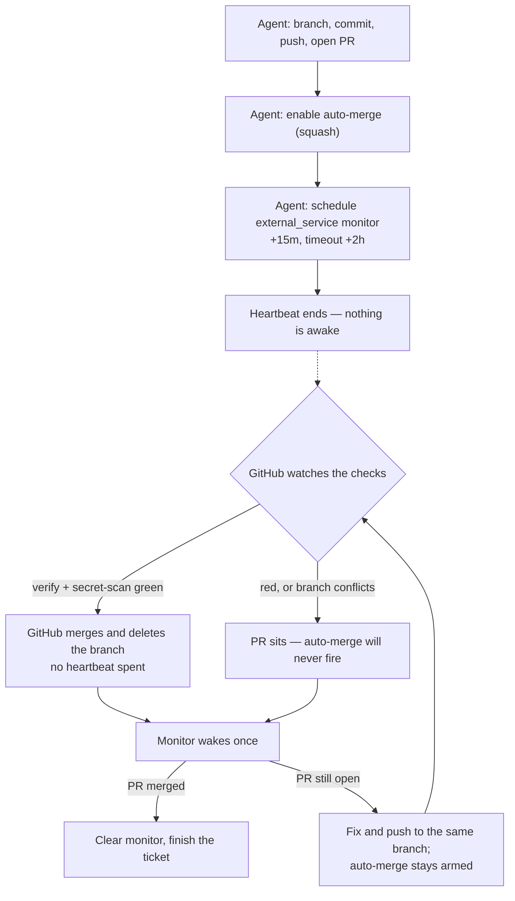

# ADR 0008 — Stage B: `main` becomes PR-only

- **Status:** decided; **not yet enforced** — one founder action is outstanding, named at the bottom.
- **Date:** 2026-09-24
- **Decided by:** CTO
- **Issue:** PRO-123 (Stage B), successor to PRO-121 (Stage A) and PRO-111 (the decision)
- **Supersedes nothing.** Extends [ADR 0007](0007-branch-protection.md), which deferred this deliberately.

## What this decides

ADR 0007 staged branch protection in two halves and shipped the cheap one. Stage A — force
pushes and deletions restricted, admins unable to bypass — is live and was measured by an actual
rejected force push, not a settings screenshot.

Stage B adds required status checks `verify` + `secret-scan`, strict, to `main`. ADR 0007 already
established the consequence that makes this a fleet change rather than a checkbox:

> A required status check cannot pass on a commit that has not been pushed yet.

So Stage B does not mean "pushes are checked". It means **direct pushes to `main` stop working**
and every change arrives through a pull request. Every agent on this team pushes straight to
`main` today, and the thing our heartbeat model handles worst is waiting. PRO-123 therefore
required three questions to be answered in writing *before* the rule is switched on. They are
answered below, then the measurements, then the order of operations.

## Q1 — How does an agent wait for CI without polling?

**It does not wait.** The waiting moves out of the heartbeat entirely, onto GitHub, and a monitor
exists only to catch the case where GitHub will never act.

1. **GitHub auto-merge is the primary mechanism.** The agent opens the PR, enables auto-merge, and
   ends the run. GitHub merges the moment both checks report success. On the happy path this costs
   **zero** additional heartbeats, because the merge is driven by the event that actually happened
   rather than by someone asking repeatedly whether it has.
2. **An issue monitor is the backstop, and only the backstop.** Auto-merge never fires on a red
   check or a conflicting branch; the PR simply sits, and the work silently never lands. So the
   same heartbeat schedules one monitor (`kind: "external_service"`, `serviceName:
   "github-actions"`, `externalRef` = the PR url, `nextCheckAt` +15m, `timeoutAt` +2h,
   `maxAttempts` 4) whose job is to notice failure. When auto-merge has already done its work, the
   wake finds the PR merged, clears the monitor and closes the ticket.

The exact payload is in the repository's `AGENTS.md`, which is where agents will actually look.
`external_service` is the only accepted `kind`; a descriptive value like `github_pr` is rejected
with a `400`, and the pull request being watched belongs in `externalRef`. This was found by
scheduling the real monitor for this ticket rather than by reading the schema, which is the reason
the payload in `AGENTS.md` is a verified one rather than a plausible one.

### Rejected

| Alternative | Why not |
| --- | --- |
| Poll inside the heartbeat — loop on `gh pr checks` until green | This is the precise failure PRO-123 was opened to prevent. It spends the whole run's budget on sleeping, and a run killed mid-wait orphans the PR with nobody scheduled to return to it. |
| Make the monitor the *only* mechanism, with no auto-merge | It works, and it is server-side polling. Every PR then costs at least one extra wake even when nothing went wrong, multiplied by the fleet. Pay for polling on the failure path only. |
| Open the PR and catch it on some later heartbeat | Nothing guarantees a later heartbeat on that issue. PRs rot, and `main` quietly stops receiving merged work — a failure that is invisible until someone asks why a shipped ticket is not in production. |

The shape of the decision is that the happy path is event-driven and the unhappy path is polled,
because only the unhappy path needs an agent to think:



## Q2 — Who presses merge?

**GitHub does**, via auto-merge with squash. That is the answer PRO-123 expected, and the check it
asked for — whether auto-merge can actually be enabled on this repository — was run today. It
cannot, yet:

| Check | Result |
| --- | --- |
| `GET /repos/Neckkup/steamkid` → `allow_auto_merge` | **`false`** — auto-merge is off at the repository level |
| `PATCH /repos/Neckkup/steamkid` `{allow_auto_merge: true}` | **`403`**, `X-Accepted-GitHub-Permissions: administration=write` |
| `GET /repos/Neckkup/steamkid` → `delete_branch_on_merge` | `false` (should be `true`; same permission, same 403) |

**This is the finding that sets the order of operations.** Turning on required checks before
turning on auto-merge would leave every agent with no non-polling way to land a change — the
expensive half of Stage B with none of the mitigation. The two settings are one change, and
`allow_auto_merge` goes first.

Rejected: *an agent merges on a later heartbeat* is Q1's rejected option restated. *A human merges*
makes the founder the throughput limit of the entire fleet, and it breaks the standing rule that we
never hand a human work an agent could do.

### Measured on PR #1: `--auto` fails open, and that is a hazard

The flow in this ADR was exercised end-to-end before being prescribed. PR #1 — the first pull
request ever opened on this repository — carried the documentation itself, which also answered a
question nobody had checked: **agents can open pull requests.** The App holds `pull_requests: write`,
so Stage B is feasible at all. That was worth confirming before making it mandatory, since Stage B
is unimplementable if it is not true.

It also surfaced something the design did not anticipate. `gh pr merge --squash --auto` **did not
fail** on a repository with `allow_auto_merge: false`. It fell back to merging the pull request
immediately, with no check having run, and reported success. Read back afterwards:
`autoMergeRequest: null`, `state: MERGED`.

This fails in the dangerous direction. An agent following the documented flow would believe it had
armed a gated merge and would have merged unverified code to `main` instead. Two consequences, both
now in `AGENTS.md`:

- **The flag is not the confirmation.** Agents must read `autoMergeRequest` back and treat `null` as
  a failure, exactly as we require a read-back for branch protection rather than trusting the
  settings page. Same principle, same reason.
- **The window closes once Stage B lands.** With required checks enforced, an immediate merge is
  refused by GitHub, so the fallback becomes a loud failure rather than a silent one. That makes the
  hazard *worst right now* — in the gap between documenting the flow and enforcing the checks —
  which is precisely the period the fleet will be reading these instructions.

### Step 1 landed: `allow_auto_merge` is `true` as of 2026-09-24

The table above is now history. The founder ticked **Allow auto-merge**, and two independent reads
agree:

| Read | Before | After |
| --- | --- | --- |
| `GET /repos/Neckkup/steamkid` → `allow_auto_merge` | `false` | **`true`** |
| GraphQL `repository.autoMergeAllowed` | `false` | **`true`** |
| `GET /branches/main` → `enforcement_level` | `off` | `off` — step 2 still pending |

`delete_branch_on_merge` is still `false`. It is hygiene, not a gate: `gh pr merge --delete-branch`
deletes the head branch per pull request, so none of the five commands depend on it.

### The prediction was wrong: `--auto` still fails open with the setting on

That section predicted the hazard would disappear once `allow_auto_merge` was `true`. It did not.
Measured the same day on PRO-129:

| PR | `autoMergeAllowed` | Checks when `--auto` ran | Result |
| --- | --- | --- | --- |
| #1 | `false` | pending | merged immediately, `autoMergeRequest: null` |
| #12 | `true` | both green | merged immediately, `autoMergeRequest: null` |
| #14 | `true` | `verify` **`IN_PROGRESS`** | merged immediately, `autoMergeRequest: null` |

PR #14 is the decisive one, because it removes the confound in #12: the setting was on, `verify` had
not finished, and the commit was on `main` seconds after the command returned `0`.

The mechanism is ordinary GitHub behaviour and the ADR simply had the dependency backwards.
Auto-merge is a queue for a **blocked** pull request. With `enforcement_level=off` and no required
contexts, nothing blocks anything, so there is no queue to join and GitHub merges. `allow_auto_merge`
makes a gated merge *expressible*; required status checks are what does the gating. **Step 1 alone
buys nothing operationally** — a useful correction to this ADR's own order-of-operations argument,
which remains right about the order and wrong about what step 1 delivers on its own.

Consequences now in `AGENTS.md`:

- **The fifth command is suspended.** Agents open the PR, schedule the monitor, and merge by hand on
  green. `--auto` returns when `npm run verify:stage-b` reports Stage B on, and the way to find out
  is to run it, not to read this paragraph.
- **The read-back rule stays**, because `autoMergeRequest: null` is still the only thing that
  separates an armed merge from a completed one — but a `null` on a merged PR now means fail-open,
  not that the repository setting is off.
- **Stage B step 2 stopped being hygiene.** It is the only thing standing between the flow this ADR
  prescribes and unverified code on `main`.

### Q2a — the `main` push run was being cancelled too (PRO-130)

The paragraph above says the push run on `main` is the last check a merged commit gets. On
2026-09-24 it was getting none: `.github/workflows/ci.yml` set `cancel-in-progress: true` on
`concurrency.group: ci-${{ github.ref }}`, and that group covers `refs/heads/main`. Each merge
cancelled the run belonging to the previous one. Runs `35961205134` and `35961231259` were both
cancelled that way, and **no commit between `943ec98` and `61bcabd` ever produced a CI result of its
own.** The two failures compound: `--auto` merged before CI answered, and then the push run that
would have caught it was killed by the next merge.

Fixed by making the cancellation conditional:

```yaml
cancel-in-progress: ${{ github.ref != 'refs/heads/main' }}
```

Superseded PR runs are still cancelled — nobody needs a result for a commit that has been pushed
over. Runs on `main` now always finish. The cost is one extra concurrent job per merge, which is
free on a public repository (Actions minutes are unmetered, ADR 0007).

Rejected alternative: drop `concurrency` entirely. That would also stop cancelling `main`, but it
gives up cancellation on PR branches, where rapid pushes are normal and the stale result is
genuinely worthless. The conditional keeps the behaviour that was wanted and removes only the one
that was destroying evidence.

If we are wrong, the migration cost is one line.

## Q3 — Required reviewers?

**No.** ADR 0007 said they are meaningless with one human. That understated it: here they are
**unsatisfiable, and turning them on would deadlock `main` completely.**

Every agent on this team pushes as the same GitHub identity — `Neckkup`, measured in PRO-121
(`GET /user` → `Neckkup`; repository permission `admin`). Pull requests opened by agents are
therefore authored by `Neckkup`. **GitHub does not permit the author of a pull request to approve
it.** With required approvals on, every PR would be authored by the only account that exists and
approvable by nobody — including the founder, who *is* that account. `main` would accept no changes
at all, from any source, and the only way out would be the founder editing branch protection again.

This is a hard technical blocker rather than a preference, so it does not get revisited on taste.
It gets revisited when one of two things changes:

- a second human with their own GitHub account joins, or
- agents are given distinct GitHub identities rather than sharing the owner's.

Until then the review gate is CI, and code review happens on the Paperclip issue — which is where
this team's review already happens in practice.

## Strict, or not?

PRO-123's done-criteria says strict. Kept, with the trade-off recorded because it is not free.

Strict means "require branches to be up to date before merging". Its cost is that every merge into
`main` invalidates the up-to-date status of every other open PR, which must be updated and re-run
before it can merge. With several agents merging concurrently this serializes the fleet and
multiplies Actions runs. Actions minutes are unmetered on a public repository (ADR 0007), so the
cost is latency, not money.

What it buys is the one failure a small fleet takes longest to notice: two pull requests that are
each green alone and break `main` together. Our merge volume is low enough that the latency cost is
small and the detection cost is not.

One expected behaviour is recorded here as an **expectation, not a measurement**: GitHub is
documented to update an out-of-date branch automatically when auto-merge is enabled and protection
requires branches to be up to date, which would make the re-run GitHub's problem rather than an
agent's. We have not observed it on this repository, because auto-merge is not enabled yet. Confirm
it on the first strict merge; if it does not hold, strict costs an extra agent round-trip per PR and
is worth reconsidering.

## Q4 — The `administration` gate, measured a third time

PRO-123 predicted this ticket would hit the same gate as Stage A. It does. Re-measured today on a
freshly issued token, after the founder's PRO-121 answer that the permission had been granted:

| Endpoint | Result |
| --- | --- |
| `GET /repos/Neckkup/steamkid/branches/main/protection` | `403`, `X-Accepted-GitHub-Permissions: administration=read` |
| `PATCH /repos/Neckkup/steamkid` (auto-merge) | `403`, `X-Accepted-GitHub-Permissions: administration=write` |
| `GET /repos/Neckkup/steamkid/actions/permissions` | `403`, `X-Accepted-GitHub-Permissions: administration=read` |
| `GET /repos/Neckkup/steamkid/rulesets` | `200` — `[]` (needs only `metadata=read`) |

The App holds no `administration` permission at any level. There is also no GitHub credential in
Paperclip secrets to fall back to — checked; the granted set is Gemini, Langfuse, Postgres and
Sentry only. Every route an agent has is closed, which is what makes the remaining step genuinely
the founder's rather than something to delegate.

## Q5 — `administration` is not grantable, and never was

The founder answered PRO-123's question by choosing "grant the Paperclip App
`Administration: Read and write`". **That option does not exist.** This is the finding that
retires three tickets' worth of the same dead end, and it is the reason this ADR gets a fifth
question it was not originally asked.

A GitHub App installation can only ever hold permissions the **App itself declares** in its
manifest. An installation owner grants from that declared set; they cannot invent a permission the
app never asked for. Two public reads settle it:

| Read | Result |
| --- | --- |
| `GET /user/installations` | installation `164005007`, app `paperclip-for-github` (app id `4831627`) — granted: `actions:read`, `checks:read`, `contents:write`, `deployments:read`, `issues:write`, `metadata:read`, `pull_requests:write`, `statuses:read`, `workflows:write` |
| `GET /apps/paperclip-for-github` (public manifest) | **declared** permissions are exactly the same nine |

The granted set already equals the declared set. Nothing is being withheld from us and nothing is
pending acceptance — there is simply no `administration` in the app to grant. The founder who went
looking for that toggle at `github.com/settings/installations/164005007` would have found no such
checkbox, searched, and concluded the instruction was wrong. It was.

This reframes the earlier three `403`s. They were read as "the founder has not granted it yet",
which made each ticket end by asking again. The correct reading is **"Paperclip's App cannot hold
this permission"**, which is not a request that can ever succeed, however many times it is made.

### Consequences

- **Option A in PRO-123 is withdrawn, not deferred.** It is not a better long-term answer that we
  keep postponing; it is unavailable. Repeating it costs a founder interruption per ticket and
  returns nothing.
- **Repository-administration changes are permanently founder-operated on this stack**, until
  Paperclip's vendor adds `administration` to the App manifest and every installation owner accepts
  the widened permission. That is a change to Paperclip the product, outside this company's control,
  and not a prerequisite we should let Stage B wait on.
- **Design around it rather than for it.** Anything an agent must do unattended has to sit inside
  `contents`, `pull_requests`, `checks`, `actions`, `issues` or `workflows`. Branch protection,
  rulesets, auto-merge and repository settings are outside that boundary and always will be. Treat a
  need for `administration` as a design smell in an agent workflow, not as a pending grant.
- **The read-back path below matters more because of this.** We cannot write the setting, so being
  able to *verify* it without `administration` is what keeps Stage B falsifiable rather than
  trust-based.

### Rejected

*Ask the founder to grant it again, more clearly.* This is what the previous two tickets did. The
evidence above says the request is unsatisfiable, so a third ask is not persistence, it is a loop.

*Give agents a classic personal access token with `repo` scope to bypass the App.* This would work
technically — a `repo`-scoped PAT carries branch-protection rights. Rejected: it is a long-lived
credential with full write access to every repository the founder owns, held by a fleet of agents,
to save one founder interaction per rare settings change. The blast radius is permanent and the
saving is small. The App's narrow scope is a feature we should not trade away for convenience.

*Have an Actions workflow enforce the rule by reverting bad pushes.* Rejected: detection-and-revert
is not a gate, it rewrites history, and it would land unverified code on `main` before undoing it —
the exact hazard `--auto` already demonstrated on PR #1.

### The other credential, now measured too

Everything above was measured against the **Paperclip App installation token**. That left one
loose end worth closing, because it would have changed the answer: Actions jobs do not run on the
App token, they run on `secrets.GITHUB_TOKEN`, a separate credential with its own permission
surface. If *that* token could write branch protection, protection-as-code would make Stage B —
and every future protection change — self-service, and the App's missing permission would stop
mattering. Nobody had checked, so four tickets' worth of "permanently founder-operated" rested on
an untested assumption.

Measured on PR #7 with two throwaway workflows, since deleted:

| Probe | Result |
| --- | --- |
| A workflow declaring `permissions: administration: write` | **Workflow rejected before any job started** — GitHub's `permissions:` block accepts a fixed key set and `administration` is not in it. The run has zero jobs and reads "this run likely failed because of a workflow file issue". |
| `GET /branches/main/protection` from a job, with the permissions the token *can* hold (`Contents: read`, `Metadata: read`) | `HTTP/2.0 403 Forbidden` |

Probe A is the stronger of the two: the ceiling is in the workflow schema, not in this repository's
Actions settings. No `permissions:` block, no repository toggle, and no organisation policy can hand
`administration` to `GITHUB_TOKEN`, because there is no syntax in which to ask for it. This is the
same shape of finding as the App manifest — the permission is not withheld, it is not expressible.

So the conclusion above is not "we have not found the right credential yet". Both credentials an
agent can reach on this stack have now been measured against the same API and both are structurally
incapable of it. Treat repository administration as outside the agent boundary and stop probing;
the next heartbeat that suspects otherwise should read this table instead of spending CI on it.

### "But the founder is an admin" is a trap, not a lead

GraphQL `repository.viewerPermission` reads **`ADMIN`** for the token agents hold, which looks like
a contradiction sitting next to four tickets of `403`. It is not one, and the distinction is worth
writing down before someone re-opens the question on the strength of that word.

The token is a GitHub App **user-to-server** token — `gh auth status` shows a `ghu_` prefix. It acts
on behalf of a user who is genuinely a repository admin, but it is still bounded by the
intersection of that user's role and the App's declared permissions. `viewerPermission` reports only
the first half. GitHub names the second half in the error itself:

```
GET /repos/Neckkup/steamkid/branches/main/protection
403  {"message": "Resource not accessible by integration"}
```

*by integration* — not "forbidden for this user". Read `viewerPermission: ADMIN` as a statement
about the human and nothing else.

## A better read-back than Stage A had

Stage A could not verify its own mandatory condition, because "do not allow bypassing" lives behind
`/branches/main/protection`, which answers `403`. It had to be proved by deliberately force-pushing
`main`. **Stage B does not need that**, and the reason is a measurement taken today that ADR 0007
did not have:

`GET /repos/Neckkup/steamkid/branches/main` needs only `contents=read` — which we hold — and its
truncated protection object *does* include the required-checks state:

```json
"protected": true,
"protection": {
  "enabled": true,
  "required_status_checks": { "enforcement_level": "off", "contexts": [], "checks": [] }
}
```

Today that reads `off` with an empty context list: Stage B is not on. When it is on, the same
endpoint reports the contexts, and `enforcement_level` distinguishes the two cases that matter —
`everyone` (admins included) versus `non_admins`, which for a fleet that pushes *as* an admin would
be decorative in exactly the way ADR 0007 warned about twice.

Two consequences:

- **PRO-123's done-criterion names the wrong endpoint.** It asks for
  `GET /rules/branches/main`. That endpoint returns `[]` and will keep returning `[]`, because
  `main` is protected by a classic branch protection rule and not by a ruleset — established in ADR
  0007's second read-back and unchanged since. Reading the criterion literally would fail a
  perfectly good configuration. The verifying endpoint is `/branches/main`.
- **The rejected direct push is still required**, and stays in the criteria. It is the only evidence
  that speaks to what actually happens to an agent rather than what the settings claim. It is now
  cheap confirmation of a readable fact rather than the sole signal.

### The one field that is still invisible: `strict`

The section above was written as though `/branches/main` covered the whole criterion. Re-reading the
full response shows it does not. The legacy protection object has exactly five readable fields —
`protected`, `protection.enabled`, and inside `required_status_checks` the `enforcement_level`,
`contexts` and `checks`. **`strict` is not among them**, and there is no other route to it:
`/branches/main/protection` is an `administration` endpoint, and `/rules/branches/main` returns `[]`
for a classic rule.

So "require branches to be up to date" — which the section above treats as settled, and which
PRO-123 asks for by name — cannot be read back at all. It gets its own experiment, and it is a cheap
one: branch from a commit behind `main`, open a PR, and watch GitHub refuse to merge until the
branch is updated. If it merges, the box was not ticked.

This does not weaken the read-back claim for the rest. `enforcement_level` really does settle the
bypass question, and that is the expensive one. It narrows the claim to: **three of the four
settings are readable, `strict` is not, and Stage B closes on two experiments rather than one.**

`npm run verify:stage-b` (`scripts/pro123-check.ts`) is that read-back as a command. It asserts
Stage A plus the three readable Stage B conditions, exits non-zero when any fails, and prints the
two experiments it cannot perform rather than quietly scoring itself as complete. The two
experiments are also why it says "readable conditions" and not "checks": what it can see is a
proper subset of what Stage B means. The founder-facing half — which two
settings, in which order, and what a mistyped context name does — is
[docs/runbooks/enable-stage-b.md](../runbooks/enable-stage-b.md), written because by then the same
request had been made on three tickets as prose in threads that scroll away.

Check context names were verified rather than assumed, against commit `441a9c8`:
`GET /repos/Neckkup/steamkid/commits/441a9c8/check-runs` returns exactly `verify` and `secret-scan`,
both from the `github-actions` app. Those two strings are what goes in the required list; a typo
here produces a branch that can never merge anything.

### An accepted confirmation card is not a measurement

The request for the two settings eventually went to the founder as a Paperclip confirmation card,
after the same request had been prose in a thread four times. The card came back **accepted** at
`05:39:41Z`. The first read afterwards, at roughly `05:41Z`, showed all three Stage B values
unchanged. A second read at `05:44:36Z` showed `allow_auto_merge` had flipped to `true`.

Nothing was wrong. The founder was clicking while the heartbeat ran. But a heartbeat that treated
the first read as the result would have written down "the founder pressed yes and changed nothing" —
accusing a human of skipping work they were doing at that moment, in a thread they read. The card's
`accepted` and the settings page are two facts separated by however long the clicking takes, and
neither is evidence for the other:

- **`accepted` means intent, not state.** It is the signal to start reading, never a substitute for
  the read.
- **One read is a sample, not a result,** when a human is changing the thing in real time. Re-read
  before writing a conclusion about a person.

This is the same rule the rest of this ADR applies to GitHub's own claims — `--auto` reporting
success, a settings page asserting a rule — extended to the one signal that felt trustworthy
precisely because a human produced it.

## Order of operations

Steps 2 and 3 are one change and the order between them is load-bearing — see Q2.

1. **Documentation lands on `main` first.** `AGENTS.md` now carries the PR flow. This is deliberate:
   PRO-123 requires the fleet to be able to read the new rules *before* the old way stops working,
   not after.
2. **Enable auto-merge** — `allow_auto_merge: true`, and `delete_branch_on_merge: true` for hygiene.
3. **Add the required checks** to the existing classic rule on `main`: `verify` and `secret-scan`,
   with "require branches to be up to date" on, leaving "do not allow bypassing the above settings"
   ticked as Stage A left it.
4. **An agent reads it back** — `npm run verify:stage-b`, which wants `contexts` containing both
   names and `enforcement_level` at `everyone`.
5. **An agent attempts one direct push to `main`** and records the rejection. That is the evidence
   PRO-123 declares non-negotiable.
6. **An agent opens a PR from a branch behind `main`** and records that it cannot merge until
   updated. That is the only way to see `strict`, which step 4 cannot read.

Steps 2 and 3 need `administration`, which per Q5 the Paperclip App cannot hold and cannot be
granted. **The founder does 2 and 3 in the settings UI; agents do 1, 4, 5 and 6.** This is the only
split available, not a fallback from a better one, and it does not improve with another ask.

The founder's half is two settings on one visit:

1. `Settings → General → Pull Requests` → tick **Allow auto-merge**.
2. `Settings → Branches → main → Edit` → tick **Require status checks to pass before merging**,
   tick **Require branches to be up to date before merging**, then search for and add **`verify`**
   and **`secret-scan`**. Leave **Do not allow bypassing the above settings** ticked as Stage A left
   it. Save.

Order matters: auto-merge first. If required checks land first, every agent is forced into a PR
flow with no way to wait for CI except burning heartbeats — the cost this ADR exists to avoid.

**Warn the founder about one consequence before step 3:** bypass is disabled for everyone, so after
this lands the founder cannot push directly to `main` either. That is the intended design — it is
what made Stage A real — but it is a change to how the founder personally works, and it should not
be a surprise discovered at the keyboard.

## Migration cost if we are wrong

| If wrong about | Cost to change |
| --- | --- |
| PR-only `main` | **Low, and reversible in one setting.** Removing the required checks restores direct pushes immediately. The branches, PRs and history created under the flow remain valid either way. |
| Auto-merge as the non-polling answer | **Low.** If auto-merge proves unreliable, the monitor path already exists as the backstop and simply becomes the primary. Cost is heartbeats, not rework. |
| Strict up-to-date | **Very low.** One checkbox, and the expected-behaviour caveat above is the thing to watch on the first merge. |
| No required reviewers | **Low, but gated on identity.** Adding reviewers is one setting, and it cannot be done safely until agents stop sharing the owner's GitHub account. The identity work is the real cost, not the setting. |
| Squash as the merge method | **None.** Per-PR choice; changing it affects only history shape. |

## What this deliberately does not decide

- **Giving agents distinct GitHub identities.** It is the unlock for required reviewers and for
  readable authorship, and it is a larger change than this ticket. Named here so Q3 has a successor.
- **Moving the repository into an organization.** Still ADR 0007's open item, still waiting on a
  second human.
- **Whether `secret-scan` should be replaced by GitHub push protection.** Push protection rejects a
  credential before the object exists on GitHub and is strictly stronger; the founder reports it is
  enabled, and we cannot verify that (`/secret-scanning/alerts` answers `403`). Until we can, the CI
  job stays as the check we can actually observe.
