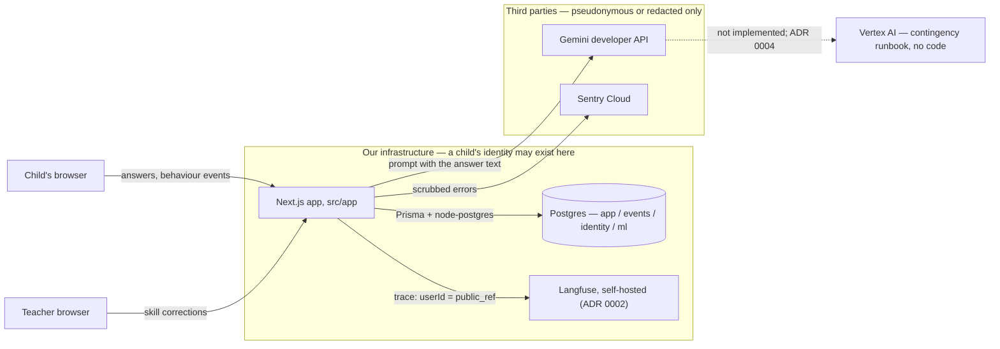
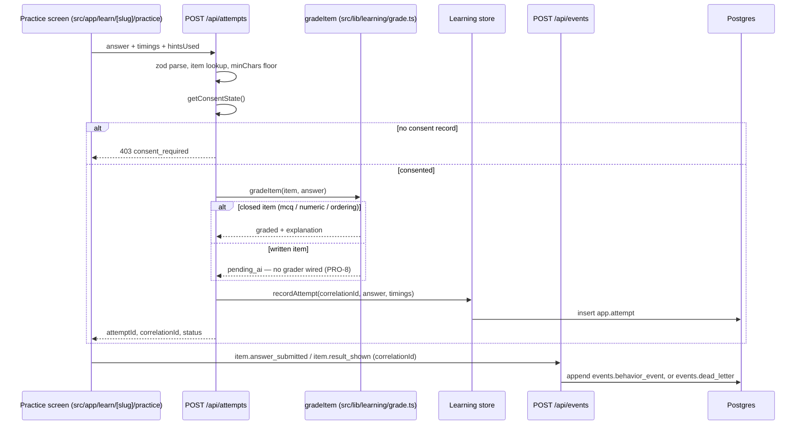
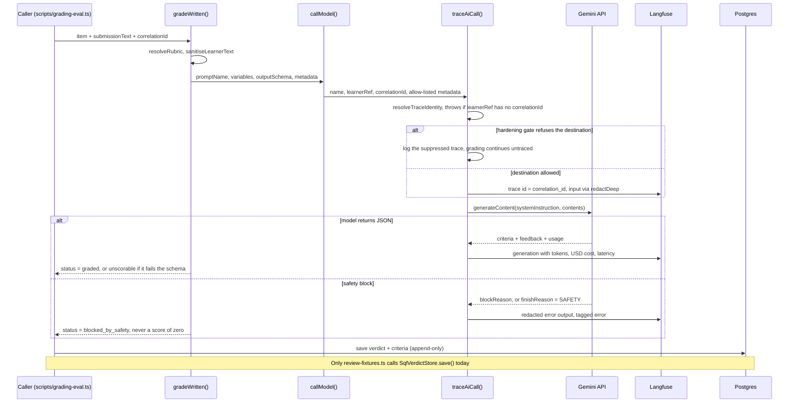
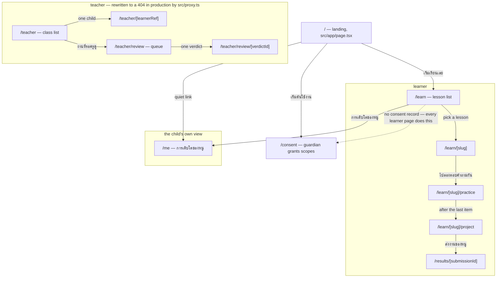
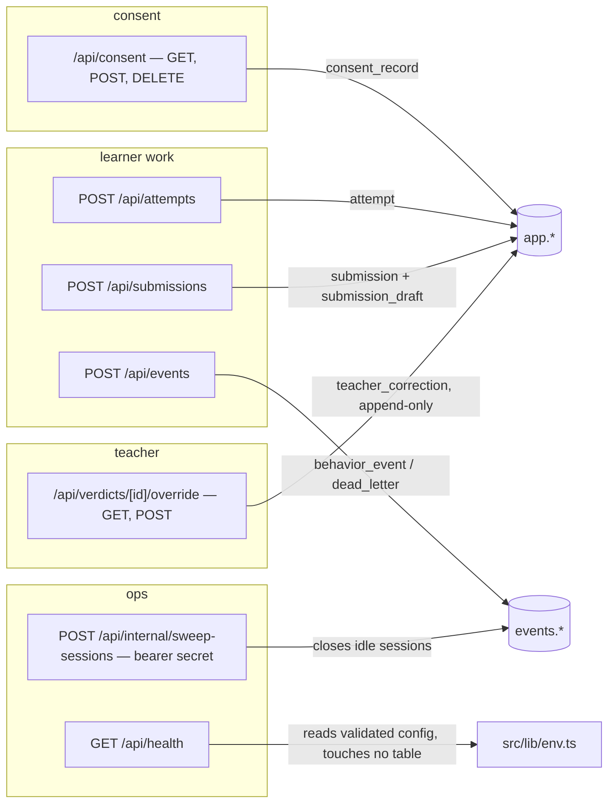
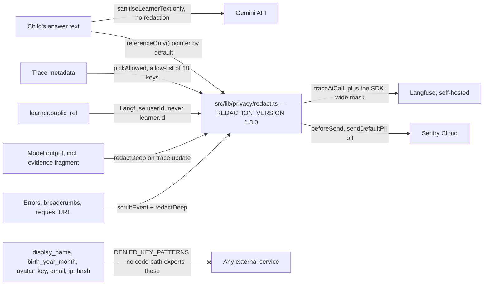

# steamkid architecture

What is actually wired together in this repository today, drawn from `src/` and
`prisma/` rather than from intent. Every diagram here is Mermaid, per
[docs/diagrams.md](diagrams.md).

**Read this first.** A diagram that flatters the code is worse than no diagram,
because it is believed. Where the code and a decision document disagree, the
diagram shows the code and the disagreement is written down in
[What the code does not do yet](#what-the-code-does-not-do-yet). The data model
has its own file: [docs/data-model.md](data-model.md).

| Diagram | What it answers |
| --- | --- |
| [System context](#1-system-context) | Which services exist and where a child's data may go |
| [Learner request path](#2-the-learner-request-path-as-it-runs-today) | What happens when a child presses submit, today |
| [AI grading path](#3-the-ai-grading-path-traceaicall-redact-gemini) | How a grading call reaches the model, and how it fails |
| [Page routes](#4-route-map--pages) / [API routes](#5-route-map--api) | The shape of `src/app` |
| [Privacy boundary](#6-privacy-boundary) | What crosses out of our infrastructure, and through what |

## 1. System context

Look at the boundary: everything outbound leaves through `src/lib/privacy/redact.ts`
or through the Gemini prompt, and nothing else has an exit.

## 2. The learner request path, as it runs today

Follow the `correlationId`: it is minted in the route, returned to the browser,
and put on the behaviour events, which is what joins a child's clicks to their
attempt later. Note what is absent — no model is called on this path.

## 3. The AI grading path: traceAiCall, redact, Gemini

This is the code in `src/lib/learning/ai-grade.ts` and `src/lib/ai/client.ts`.
The caller is what to notice: today only `scripts/grading-eval.ts` reaches it, so
the path is real and tested but no learner route enters it.

## 4. Route map — pages

Read it as three audiences. `/teacher` is the one with a hard edge: the whole
subtree is rewritten to a 404 on the production tier by `src/proxy.ts`.

## 5. Route map — API

Grouped by who calls them. Everything a child produces lands in `app.*` or
`events.*`; nothing here reads a model.

## 6. Privacy boundary

The one thing to take away: `redact.ts` guards Langfuse and Sentry, **not**
Gemini. A child's answer text reaches the model in full, deliberately — that is
what ADR 0004's paid-tier, zero-retention posture is buying.

## What the code does not do yet

Written here rather than fixed in code, because this issue is documentation.
Each line is a place a reader would otherwise trust a diagram that is ahead of
the repository.

1. **There is no Vertex AI fallback in the code.** `grep -ri vertex src/` returns
   nothing. [ADR 0004](adr/0004-llm-provider-gemini.md) *rejected* Vertex and
   [the runbook](runbooks/vertex-ai-fallback.md) is explicitly "contingency plan,
   not scheduled, do not execute preemptively". The runbook also records that
   Vertex carries the same under-18 restriction, so it is a continuity plan, not
   a compliance one. The diagram shows it dotted and unimplemented.
2. **No learner-facing route calls the grader.** `/api/attempts` answers
   `pending_ai` for written items and `/api/submissions` answers
   `awaiting_grading`; `gradeWritten()` is reachable only from
   `scripts/grading-eval.ts`. The grading engine exists; it is not connected.
3. **Nothing in product code writes `app.ai_verdict`.** The only caller of
   `SqlVerdictStore.save()` is `src/lib/learning/review-fixtures.ts`, so the
   teacher review queue is populated by fixtures. The override path
   (`POST /api/verdicts/[id]/override`) is real and writes real rows.
4. **`README.md` says `prisma/schema.prisma` holds "domain tables land in
   PRO-3 / PRO-7"** — they have landed, and the schema header now says the SQL
   migrations are the source of truth. The README layout table is stale.
5. **Langfuse traces may legally carry answer text but do not.** ADR 0002 chose
   self-hosting precisely so a trace can show what was graded, yet `callModel()`
   still defaults `input` to a `referenceOnly()` pointer. Deliberate or not, the
   ADR's stated benefit is currently unclaimed.
6. **There is no classroom in the schema.** `/teacher` lists every learner with a
   snapshot, as its own page comment says.
