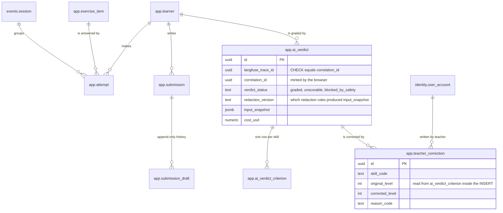
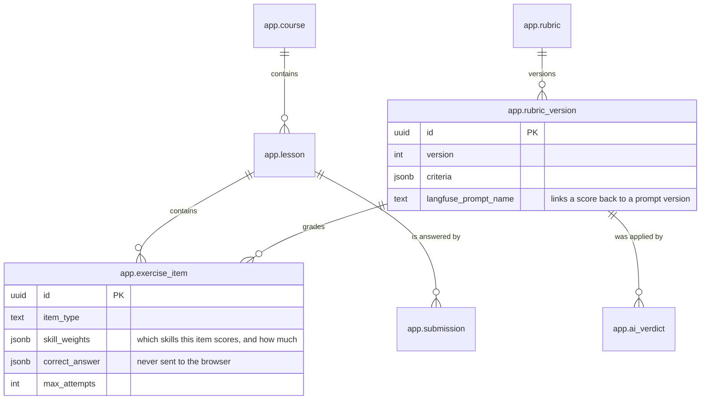
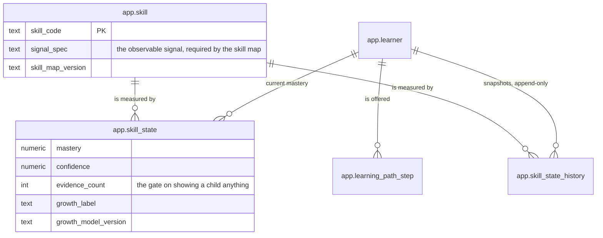
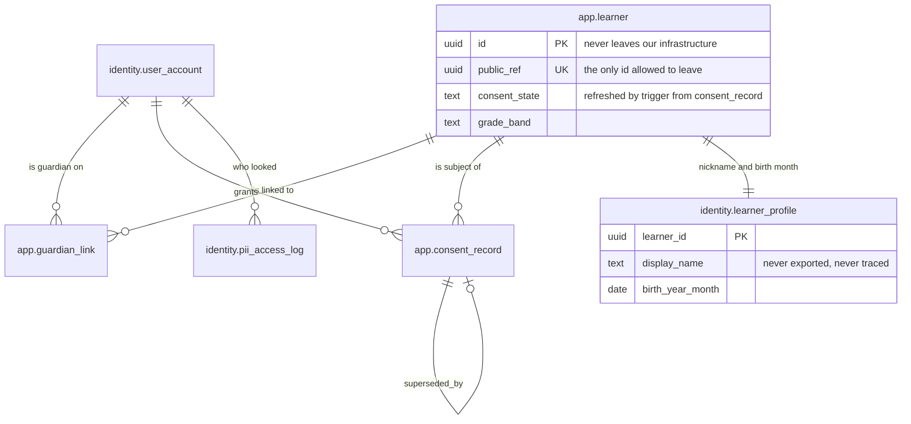
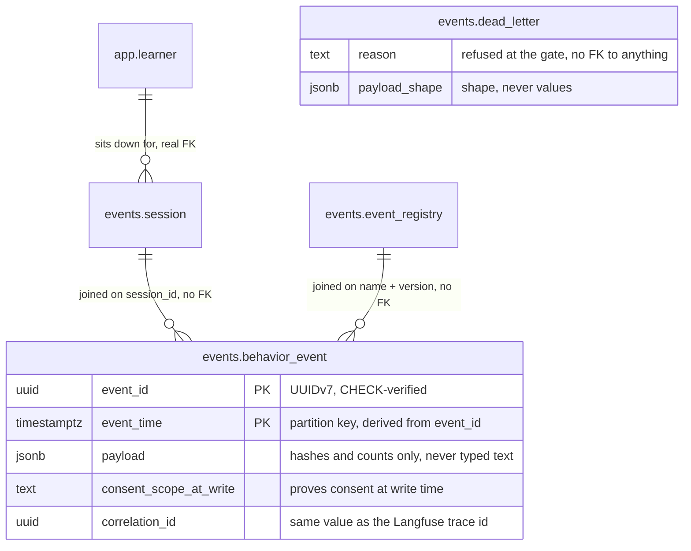

# Data model

Drawn from `prisma/migrations/*/migration.sql` and the re-pulled
`prisma/schema.prisma`. Four Postgres schemas — `app`, `events`, `identity`,
`ml` — split into five diagrams, because one ER diagram with twenty-four tables
is a paragraph in disguise (see [docs/diagrams.md](diagrams.md), house rule 1).

Companion to [docs/architecture.md](architecture.md).

**Two things `prisma db pull` cannot show, so they are written here instead.**
The `ml.*` export views do not appear in `schema.prisma` at all (introspecting
views needs a preview feature), and neither do the triggers, CHECK constraints
or the `PARTITION BY RANGE` on `events.behavior_event`. The append-only
guarantee lives in the migrations, not in the Prisma file.

## 1. A child's work becomes a training label

This is the chain the company exists to collect: what the child wrote, what the
model said, and where a teacher disagreed. Every table on it is append-only,
enforced by a `BEFORE UPDATE OR DELETE` trigger calling `app.reject_mutation()`.

## 2. Content and rubrics

The versioned half. A score that cannot name the rubric version behind it is a
label nobody can clean later, so `rubric_version` is a table, not a column.

## 3. Skills and growth

`skill_state` is the current answer and `skill_state_history` is how it got
there — the second is append-only, so "this child improved at skill X" is a
claim you can recompute rather than a chart you have to trust.

## 4. Consent and identity

`consent_record` is append-only with a `superseded_by` self-link, so withdrawal
is a new row and the state at any past moment is still provable. Everything a
child could be recognised by lives in `identity.*` and in no other schema.

## 5. The behaviour log and the export surface

`events.behavior_event` deliberately has **no foreign keys**: it is
`PARTITION BY RANGE (event_time)` with monthly partitions, retention is
`DROP PARTITION`, and its primary key `(learner_id, event_id, event_time)` plus
the `event_time = app.uuidv7_timestamp(event_id)` CHECK is what makes
`ON CONFLICT DO NOTHING` a complete de-duplication rule.

`events.dead_letter` is drawn without edges on purpose: a refused event never
reached `behavior_event`, and its `learner_id` / `event_id` columns are nullable
with no foreign key, because the whole point is to record something that did not
validate.

The `ml.*` schema is the export surface and contains no tables of its own except
`ml.training_export_run` (one row per export: spec version, filters, consent
snapshot time, row count, checksum, redaction version). Everything else there is
a consent-filtered view, gated on the opt-in `training_use` scope:

| View | Rows |
| --- | --- |
| `ml.v_consented_learner` | **internal join surface, not an export** — the only view allowed to expose `learner_id`; `ml-views.test.ts` enforces that the others select `public_ref` only |
| `ml.v_grading_examples` | graded verdicts: item + rubric + redacted answer + the score that survived teacher review |
| `ml.v_teacher_corrections` | model level vs teacher level per skill. `note` is excluded — free text an adult typed about a child |
| `ml.v_behaviour_sequences` | events the registry marks `exportable`, for `scorable` sessions only |
| `ml.v_growth_labels` | `skill_state_history` snapshots as labels |
