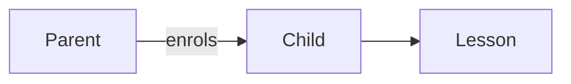
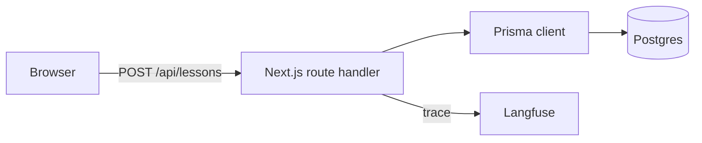
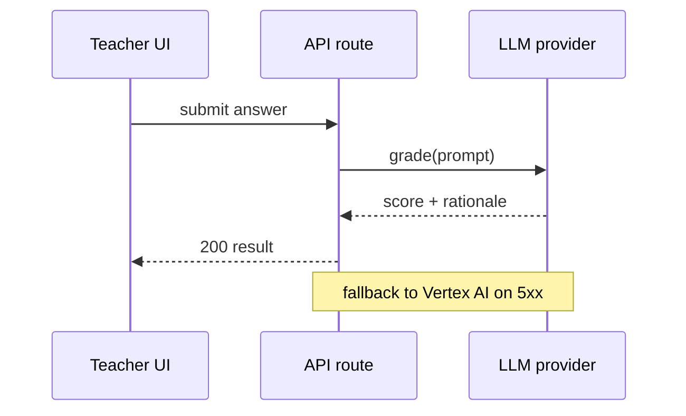
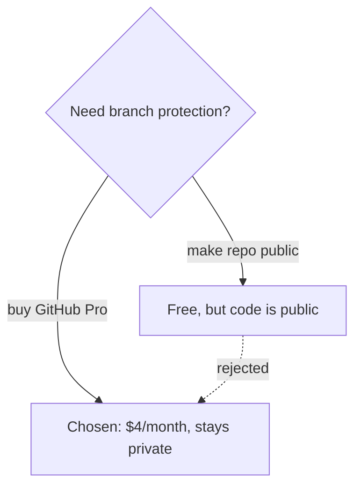

# Diagrams: Mermaid is the format

**Rule.** Every diagram that lives in `docs/`, in an ADR, in a runbook, in a task
plan, or in a Paperclip comment is written as a **Mermaid code block in
Markdown**. No screenshots of whiteboards, no exported PNGs of boxes and arrows,
no ASCII art, no draw.io links as the only source.

Why: Mermaid renders in GitHub, in the Paperclip board, and in most editors; it
diffs line by line in review; and a diagram that is text stays correct because
anyone can fix it in the same PR as the code it describes.

## How to write one

Fence the block with `mermaid`:

````markdown

````

### Picking a diagram type

| You are showing | Use | Header keyword |
| --- | --- | --- |
| A flow, a pipeline, an architecture | flowchart | `flowchart TD` / `flowchart LR` |
| Who calls whom, in what order | sequence | `sequenceDiagram` |
| Tables and their relations | ER | `erDiagram` |
| Allowed states and transitions | state | `stateDiagram-v2` |
| Phases over time | gantt | `gantt` |
| A decision that split into options | flowchart with a diamond | `flowchart TD` |

Default to `flowchart` and `sequenceDiagram`. If a diagram needs a type not in
this table, it is usually two diagrams.

## House rules

1. **One idea per diagram.** If it needs more than ~15 nodes, split it or show a
   subsystem. A diagram nobody can read at a glance is a paragraph in disguise.
2. **Direction:** `LR` for pipelines and request paths, `TD` for hierarchies and
   decisions.
3. **Label the edges**, not just the nodes — `-->|writes|` beats a bare arrow.
4. **Name nodes with stable ids and human labels:** `db[(Postgres)]`,
   `api[Teacher route]`. Ids are what future diffs touch.
5. **No colour as the only signal.** Use shape and label text too; the board
   renders both themes and some readers do not see the hue.
6. **Quote anything with punctuation:** `A["GET /api/lessons?id=1"]` — bare
   parentheses, colons and slashes break the parser.
7. **Keep it beside what it describes.** A diagram in an ADR explains that
   decision; a diagram in a runbook explains that procedure. Do not start a
   diagram museum.
8. **One sentence of prose above every diagram** saying what to look at. The
   diagram supports the sentence, not the other way round.

## Examples

Request path — `flowchart LR`:



Ordering between services — `sequenceDiagram`:



A decision and what was rejected — the shape ADRs should use:



## Review checklist

A doc PR with a diagram is not done until:

- [ ] the block is fenced ` ```mermaid `, not ` ```text ` or an image
- [ ] it renders (paste into <https://mermaid.live> or the GitHub preview)
- [ ] labels match the real names in the code (route paths, table names)
- [ ] the sentence above it says what the reader should take away

## When Mermaid genuinely does not fit

Pixel-level UI mockups, screenshots of a real bug, and photographs are not
diagrams — attach those as images. Everything structural is Mermaid. If you
think you have found another exception, say so in the PR rather than quietly
attaching a PNG.
