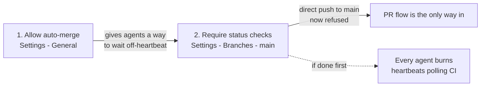

# Runbook — turn on Stage B (required checks on `main`)

- **Status (2026-09-24): step 1 is on, step 2 is not.** `npm run verify:stage-b`
  reads `autoMergeAllowed=true` (step 1, ticked by the founder) and
  `enforcement_level=off` with no contexts (step 2). Both are readable by that
  one command, so the state of this runbook is checkable rather than asserted.
- **Step 2 is now the urgent one, not the tidy one.** With step 1 alone,
  `gh pr merge --auto` merges immediately instead of waiting for CI — measured on
  PR #14 with `verify` still running (PRO-129). Required checks are what make a
  merge wait, so until step 2 lands the fleet merges by hand on green and
  `AGENTS.md` tells agents not to pass `--auto` at all.
- **Owner of the remaining step:** the founder, at the GitHub web UI
- **Owner of the verification:** CTO
- **Issue:** [PRO-123](/PRO/issues/PRO-123) — Stage B
- **Decision record:** [ADR 0008](../adr/0008-pr-flow-on-main.md); the staging
  into A and B comes from [ADR 0007](../adr/0007-branch-protection.md)

**Why this document exists rather than another comment on the ticket.** This has
been asked for on three tickets and each ask was a wall of prose in a thread that
scrolls away. The clicks are order-sensitive and one of the fields must be typed
exactly, so the instruction needs to live somewhere stable and be checkable by a
command instead of by agreement.

## 1. What is already true

Stage A is on: `main` is protected, and that protection has been proven against a
real admin force push (PRO-121). Direct pushes that *rewrite* history are already
refused. What is **not** yet true is that ordinary direct pushes are refused, and
that is Stage B.

## 2. Why an agent cannot do this

The Paperclip GitHub App does not **declare** the `administration` permission, so
the founder cannot grant it — the checkbox does not exist on the installation
page. Measured four times now; see ADR 0008 Q5. Every settings write
(`PATCH /repos`, `POST /rulesets`, `PUT /branches/main/protection`) answers `403`
permanently, and re-testing it is wasted heartbeat.

## 3. The two changes, in this order

The order is the part that is easy to get wrong, and getting it wrong is not
cosmetic.



If step 2 lands before step 1, the whole fleet is forced into pull requests with
no way to wait for CI except polling — which is exactly the cost ADR 0008 was
written to avoid.

### Step 1 — Allow auto-merge

`Settings` → `General` → **Pull Requests**

- tick **Allow auto-merge**
- tick **Automatically delete head branches** (optional, keeps the branch list clean)

### Step 2 — Require the two status checks

`Settings` → `Branches` → rule for `main` → `Edit`

- tick **Require status checks to pass before merging**
- tick **Require branches to be up to date before merging**
- in the search box add these two, spelled exactly:
  - `verify`
  - `secret-scan`
- **leave "Do not allow bypassing the above settings" ticked** — Stage A set it
- `Save changes`

The two names are the `jobs:` keys in `.github/workflows/ci.yml`. A typo does not
fail loudly: GitHub will wait forever for a check that will never report, and
`main` becomes unmergeable by anyone.

**If the UI takes you to `Settings` → `Rules` → `Rulesets` instead, that is fine.**
GitHub has two branch-rule systems and steers different accounts to different
ones; a `required_status_checks` rule in a ruleset targeting `main` enforces the
same thing. `verify:stage-b` reads both places, so either route verifies. Two
differences worth knowing before you pick: a ruleset exposes **Require branches
to be up to date** to us (one fewer thing to prove by experiment), and it spells
"Do not allow bypassing" as an empty **Bypass list** that we cannot read back —
so under a ruleset the push test in §5 is the only evidence that the rule binds
the owner.

### สำหรับผู้ก่อตั้ง — สองที่ ตามลำดับนี้

1. `Settings` → `General` → **Pull Requests** → ติ๊ก **Allow auto-merge**
2. `Settings` → `Branches` → กฎของ `main` → `Edit`
   - ติ๊ก **Require status checks to pass before merging**
   - ติ๊ก **Require branches to be up to date before merging**
   - เพิ่มสองชื่อนี้ ตัวสะกดต้องตรงเป๊ะ: `verify` และ `secret-scan`
   - **ปล่อย "Do not allow bypassing the above settings" ติ๊กไว้เหมือนเดิม**
   - กด `Save changes`

**บอกไว้ก่อนกด:** หลังจากนี้ผู้ก่อตั้งเองก็จะ `git push origin main` ตรง ๆ ไม่ได้
ต้องเปิด pull request เหมือนเอเจนต์ทุกตัว — เป็นสิ่งที่ตั้งใจ ไม่ใช่ความผิดพลาด

## 4. Verify

```bash
npm run verify:stage-b
```

Exit code 0 is the whole check; anything it cannot read prints `UNK` and is
excluded from the score rather than guessed at. It reads
`GET /repos/Neckkup/steamkid/branches/main` **and**
`GET /repos/Neckkup/steamkid/rules/branches/main`, both of which need only
`contents:read`, so any agent can run it without the permission we do not have.

Reading both is not belt-and-braces. Required checks set in a ruleset are absent
from the classic payload entirely, so a checker that read only the classic shape
would report `enforcement_level=off` — "the founder has not ticked anything" —
about a `main` that was already refusing merges. The header line names which
source the answers came from.

What it can see, and what it cannot:

| Condition | classic branch protection | ruleset |
| --- | --- | --- |
| `main` is protected | readable — `protected`, `protection.enabled` | same (Stage A is classic either way) |
| required checks are enforced | readable — `enforcement_level` is not `off` | readable — the rule is present |
| the bypass list is empty | readable — `enforcement_level` is `everyone`, not `non_admins` | **not readable** — see §5 |
| exactly `verify` + `secret-scan` | readable — `contexts` | readable — `parameters.required_status_checks` |
| **strict** (up to date before merging) | **not readable** — see §5 | readable — `strict_required_status_checks_policy` |

`enforcement_level` is the one worth knowing about. It is not a duplicate of
`enabled`; it records *who* the checks bind, and `everyone` is how the legacy
branches API renders "Do not allow bypassing". That is why the ticket's
"bypass list is still empty" criterion is checkable at all without
`administration`.

## 5. The two things only an experiment can prove

A settings page is a claim. These are the events.

**Strict.** Branch from a commit that is behind `main`, open a PR, and confirm
GitHub blocks the merge until the branch is updated. If it merges anyway,
**Require branches to be up to date** did not get ticked.

**The rule binds.** One direct push, expected to be refused:

```bash
git fetch origin && git switch -c stage-b-probe origin/main
git commit --allow-empty -m "Stage B probe: this push must be refused"
git push origin HEAD:main     # expect: protected branch hook declined
```

A `GH006` / "Protected branch update failed" rejection is the evidence PRO-123
asks for and a screenshot of the settings page is not. Clean up with
`git branch -D stage-b-probe` — nothing was pushed.

## 6. If it needs to come back off

Untick **Require status checks to pass before merging** in the same place. Stage A
is a separate tick and should stay on. There is no migration and no data to undo;
the cost of being wrong here is one more visit to the settings page, which is why
ADR 0008 treats this as reversible and Stage A as the one that mattered.

## 7. Log

| Date | Event |
| --- | --- |
| 2026-09-24 | Runbook written; `verify:stage-b` reads 1/4, Stage A only. Waiting on the founder. |
| 2026-09-24 | Step 1 (auto-merge) ticked; `verify:stage-b` reads 3/6. Step 2 still open. |
| 2026-09-24 | Verifier now reads rulesets as well as classic protection. Measured `GET /rules/branches/main` = `200 []`, so step 2 has not been done by either route. |
